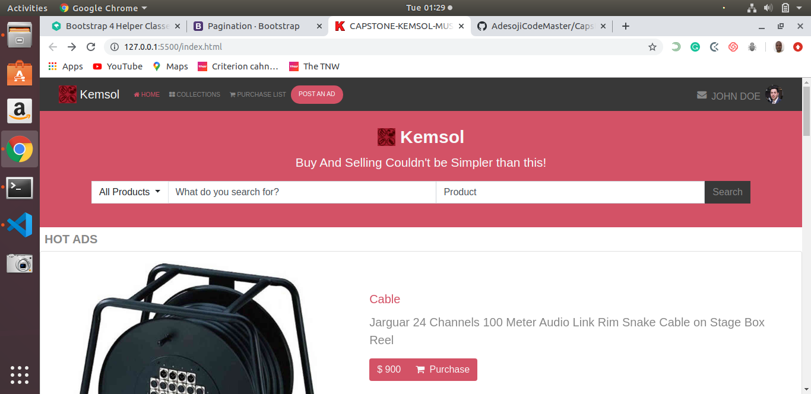
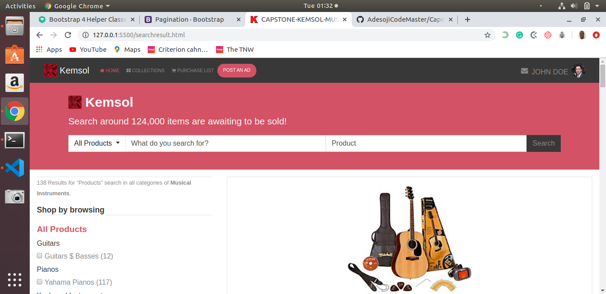

MICROVERSE CAPSTONE PROJECT

## Capstone Project Title: Capstone-Kemsol-Music-Center

This capstone project was created a using HTML, CSS and BOOTSTRAP. In this project I was required to create a customised Website(In my own case I made it to be Musical Instruments Website intead of Electronics Website in the original) with Homepage and Search Results Page which is a replica of [ZATTIX](https://www.behance.net/gallery/24796463/ZATTIX) by Mohammed Awad. The home page is the landing page from where one can navigate to search results page by clicking search button at the top in the home page.

In this project (Capstone-Kemsol-Music-Center) I created a customised website similar to ZATTIX using the best practices of HTML, CSS & Bootstrap with GitHub process flow.

## Built With

- HTML5,
- CSS3,
- Bootstrap.

## Live Demo

[Live Demo Link](https://rawcdn.githack.com/AdesojiCodeMaster/Capstone-Kemsol-Music-Center/4691873f9699d99ec7d1968e5138464805e9cecb/index.html)

## Author

👤 Adesoji Adewumi

- Github: [@AdesojiCodeMaster](https://github.com/AdesojiCodeMaster)
- Twitter: [@codemas22665735](https://twitter.com/codemas22665735)
- Linkedin: [linkedin](https://www.linkedin.com/in/adesoji-adewumi-7752aba5)

## 🤝 Contributing

Contributions, issues and feature requests are welcome!

## Show your support

Give a ⭐️ if you like this project!

## Acknowledgments

- Microverse
- GitHub
- TheOdinProject
- Mohammed Awad (ZATTIX)

 ## 📝 License MIT

This project is an open licensed.